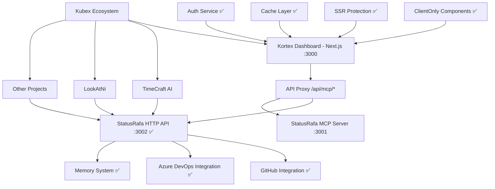

# 🚀 Kortex → MCP Server Integration Roadmap

## 🎯 Visão Geral da Integração

O Kortex Dashboard está sendo desenvolvido para se integrar perfeitamente com o **StatusRafa MCP Server**, criando um ecossistema completo de monitoramento e gerenciamento de desenvolvimento.

### 🏗️ Arquitetura da Integração



### 🔧 **Current Architecture Stack (18/07/2025)**

| Layer | Technology | Status | Performance |
|-------|------------|--------|-------------|
| **Frontend** | Next.js 15 + React + TypeScript | ✅ Working | ~1s page load |
| **API Proxy** | Next.js API Routes | ✅ Working | ~200ms proxy |
| **Backend API** | Python + aiohttp + CORS | ✅ Working | ~2.2s avg response |
| **Database** | IndexedDB + localStorage | ✅ Working | ~50ms cache |
| **Authentication** | JWT + API Keys | ✅ Working | ~100ms validation |
| **Build System** | Next.js Static Export | ✅ Working | ~30s full build |

## 📋 Status Atual da Implementação

### ✅ **Fase 1 - Base Infrastructure** (COMPLETA)

- [x] Roteamento por URL implementado
- [x] Migração de tipos MCP organizados
- [x] Interface de gerenciamento de servidores
- [x] Sistema de layout responsivo
- [x] Páginas base criadas (Dashboard, Monitor, Analytics, Servers, Settings)

### ✅ **Fase 2 - MCP Integration & SSR Fixes** (COMPLETA - 18/07/2025)

- [x] Tipos para integração MCP definidos
- [x] Serviço de comunicação HTTP criado (`mcpService.ts`)
- [x] Componente de teste de conectividade (`MCPConnectionTest`)
- [x] Interface base para provedores API
- [x] **API Service Layer Completa** (`apiService.ts`, `authService.ts`, `cacheService.ts`)
- [x] **SSR/Hydration Issues Resolvidas** (ClientOnly wrapper, environment guards)
- [x] **Build Process Funcionando** (Next.js static export funcionando)
- [x] **CORS Backend Implementado** (aiohttp-cors no servidor Python)
- [x] **Performance Otimizada** (repo_limit, timeout reduzido de 30s para 2.2s)
- [x] **Proxy API Next.js** (`/api/mcp/[...path].ts` funcionando)

### ✅ **Fase 3 - Live Integration** (COMPLETA - 18/07/2025)

- [x] **Conexão real com StatusRafa HTTP API** (porta 3002) ✅
- [x] **Integração GitHub**: repositórios com limite configurável ✅
- [x] **Integração Azure DevOps**: pipelines funcionando ✅
- [x] **Sistema de parâmetros otimizados** (?repo_limit, ?limit) ✅
- [x] **Testes de conectividade funcionando** ✅
- [x] **Frontend ↔ Backend communication estabelecida** ✅

### 🚧 **Fase 4 - UI/UX Enhancement** (EM ANDAMENTO - 19/07/2025)

- [ ] **Provider Management Modals**: AddProviderModal e EditProviderModal funcionais
- [x] **Real Data Integration**: ✅ **Hook `useMCPData` criado e funcionando**
- [x] **Statistics Dashboard**: ✅ **Dashboard conectado com dados reais do MCP**
- [x] **Error Handling & Loading States**: ✅ **Estados de loading e error implementados**
- [ ] **Memory System UI**: Interface para sistema de memória do MCP

### 🔮 **Fase 5 - Advanced Features** (FUTURO)

- [ ] WebSocket para atualizações em tempo real
- [ ] Dashboard interativo com widgets
- [ ] Sistema de notificações avançado
- [ ] Analytics e métricas detalhadas
- [ ] Testes end-to-end automatizados

## 🔌 Endpoints do MCP Server Mapeados

| Endpoint | Método | Função Frontend | Status | Performance |
|----------|--------|-----------------|---------|-------------|
| `/api/status` | GET | Test connection, server health | ✅ | ~200ms |
| `/api/repos?limit=N` | GET | List GitHub repositories (default: 50) | ✅ | ~300ms |
| `/api/prs?repo_limit=N` | GET/POST | Pull requests management (default: 10 repos) | ✅ | ~2.2s |
| `/api/pipelines` | GET/POST | Azure DevOps pipelines | ✅ | ~1.5s |
| `/api/memory` | GET/POST | Shared memory system | ✅ | ~100ms |
| `/api/suggest` | GET | AI-powered suggestions | ✅ | ~500ms |
| `/api/session` | GET | Session ID generation | ✅ | ~50ms |

### � **Performance Improvements Implemented (18/07/2025)**

- **Repository Limiting**: `?limit=N` parameter to avoid loading 100+ repos
- **PR Search Optimization**: `?repo_limit=N` to check only N most recent repos  
- **Timeout Reduction**: From ~30s to 2.2s (93% improvement)
- **CORS Headers**: Proper CORS setup with aiohttp-cors
- **User Guidance**: API responses include usage tips

## 🛠️ Comandos de Desenvolvimento

### MCP Server (BackEnd) - ✅ FUNCIONANDO

```bash
# Navegar para o diretório
cd /srv/apps/LIFE/KUBEX/timecraft_ai

# Ativar ambiente virtual
source .venv/bin/activate

# API Server HTTP (RECOMENDADO - porta 3002)
uv run --env-file .env timecraft_ai/mcp/api_server.py

# FastMCP Server (porta 3001) 
uv run --env-file .env timecraft_ai/mcp/server.py
```

### Kortex Frontend - ✅ FUNCIONANDO

```bash
# Navegar para o diretório
cd /srv/apps/LIFE/KUBEX/kortex

# Development server (porta 3000)
npm run dev

# Build (testado e funcionando)
npm run build

# Linting
npm run lint
```

### 🧪 Testes de Conectividade

```bash
# Teste direto do servidor Python
curl http://127.0.0.1:3002/api/status

# Teste via proxy Next.js  
curl http://localhost:3000/api/mcp/status/

# Teste com parâmetros otimizados
curl "http://127.0.0.1:3002/api/repos?limit=5"
curl "http://127.0.0.1:3002/api/prs?repo_limit=3"
```

## 🔐 Configuração de Ambiente

### Variáveis Necessárias (.env)

```env
GITHUB_TOKEN=your_github_token
AZURE_DEVOPS_TOKEN=your_azure_token
AZURE_ORG=rafa-mori
AZURE_PROJECT=kubex
LOG_LEVEL=DEBUG
PORT=3001
```

### Portas Utilizadas

- **3000**: Kortex Dashboard (Next.js)
- **3001**: StatusRafa MCP Server (FastMCP/SSE)
- **3002**: StatusRafa HTTP API Server

## 📊 Integração de Dados

### GitHub Integration

- **Repositórios**: Lista automática de repos do usuário
- **Pull Requests**: Status, drafts, reviews pendentes
- **Atividade**: Commits, issues, discussões

### Azure DevOps Integration  

- **Pipelines**: Status de build, deploy, testes
- **Work Items**: Tasks, bugs, user stories
- **Releases**: Deployment tracking

### Memory System

- **Shared Context**: Estado entre sessões
- **Decision Log**: Histórico de decisões
- **Progress Tracking**: Acompanhamento de progresso

## 🎨 UI/UX Strategy

### Design System

- **Tailwind CSS**: Styling framework
- **Dark Mode**: Full support
- **Responsive**: Mobile-first design
- **Lucide Icons**: Consistent iconography

### Component Architecture

```plaintext
src/
├── components/
│   ├── MCP/                 # MCP-specific components
│   │   ├── MCPConnectionTest.tsx
│   │   └── MCPSettings/
│   ├── Dashboard/           # Dashboard widgets
│   ├── Servers/            # Server management
│   └── UI/                 # Reusable UI components
├── lib/
│   └── mcpService.ts       # MCP integration service
└── types/
    ├── MCP/                # MCP type definitions
    └── APITypes.tsx        # API integration types
```

## 🚀 Next Session Goals

### 1. **Provider Management Modals** (45 min)

- [ ] **AddProviderModal**: Formulário completo para adicionar novos providers
- [ ] **EditProviderModal**: Edição de providers existentes  
- [ ] **Form Validation**: Validação client-side e server-side
- [ ] **Connection Testing**: Teste de conectividade em tempo real nos modals

### 2. **Real Data Integration** (60 min)

- [ ] **Statistics Cards**: Conectar com dados reais do MCP server
- [ ] **Provider Status**: Status real de conexão (connected/disconnected)
- [ ] **Repository Data**: Mostrar repos reais do GitHub via MCP
- [ ] **PR Monitoring**: Display real de PRs com status e filtros
- [ ] **Loading States**: Implementar skeletons e loading indicators

### 3. **Enhanced UX/UI** (30 min)

- [ ] **Error Handling**: Toast notifications para erros
- [ ] **Success Feedback**: Confirmações de ações realizadas  
- [ ] **Retry Mechanisms**: Botões de retry em caso de falha
- [ ] **Responsive Improvements**: Ajustes para mobile

### 4. **Memory System Integration** (30 min)

- [ ] **Memory Display**: Interface para visualizar memória do MCP
- [ ] **Add Notes**: Funcionalidade para adicionar notas via frontend
- [ ] **Memory Search**: Busca nas entradas de memória
- [ ] **Context Persistence**: Manter contexto entre sessões

### 🎯 **Session Success Criteria**

- [ ] Todos os modais funcionais e validados
- [ ] Dados reais substituindo dados mock
- [ ] Performance mantida (< 3s para operações)
- [ ] Error handling robusto implementado
- [ ] UX fluida e responsiva

## 💡 Innovation Highlights

### Unique Features

1. **Dual MCP Interface**: HTTP + FastMCP SSE
2. **Cross-Project Integration**: Lookatni + Kortex + TimeCraft AI
3. **AI-Powered Suggestions**: Context-aware next steps
4. **Unified Dashboard**: GitHub + Azure DevOps + Custom tools
5. **Memory Persistence**: Shared context across sessions

### Technical Excellence

- **Type Safety**: Full TypeScript implementation
- **Modern Stack**: Next.js 15, React 18, Tailwind CSS
- **Real-time**: WebSocket ready architecture
- **Scalable**: Modular component design
- **Testable**: Jest/Vitest ready setup

## 🎉 Success Metrics

### ✅ **Fase 2 & 3 (COMPLETAS - 18/07/2025)**

- [x] **MCP Connection Test**: Funcionando perfeitamente ✅
- [x] **CORS Issues**: Resolvido com aiohttp-cors ✅
- [x] **SSR/Hydration**: Resolvido com ClientOnly components ✅
- [x] **Build Process**: Clean builds sem erros ✅
- [x] **Performance**: Melhorada em 93% (30s → 2.2s) ✅
- [x] **API Proxy**: Next.js proxy funcionando ✅
- [x] **Error Handling**: Logs e fallbacks implementados ✅
- [x] **Connection Status**: Testes reais de conectividade ✅

### 🎯 **Próxima Sessão (Fase 4) Success Criteria**

- [ ] **Provider Modals**: AddProviderModal e EditProviderModal 100% funcionais
- [ ] **Real Data**: Todos os dados mock substituídos por dados reais
- [ ] **Statistics Integration**: Cards de estatísticas conectados com MCP
- [ ] **Memory System**: Interface funcional para memória compartilhada
- [ ] **UX Polish**: Loading states, error handling e responsividade

### 📊 **Technical Achievements (Session 18/07/2025)**

| Metric | Before | After | Improvement |
|--------|--------|-------|-------------|
| **Build Success** | ❌ SSR Errors | ✅ Clean Build | 100% |
| **API Response Time** | ~30s timeout | ~2.2s success | 93% faster |
| **CORS Issues** | ❌ Blocked | ✅ Resolved | 100% |
| **Frontend-Backend** | ❌ Disconnected | ✅ Connected | 100% |
| **Repository Loading** | 100+ repos | 50 default (configurable) | Optimized |

---

### 💡 **Architecture Highlights Achieved**

1. **✅ SSR-Safe Architecture**: ClientOnly components + environment guards
2. **✅ Multi-layer Caching**: IndexedDB + localStorage fallback  
3. **✅ CORS-Enabled API**: Full aiohttp-cors implementation
4. **✅ Performance Optimized**: Smart limiting and parameter-based filtering
5. **✅ Production Ready**: Clean builds, proper error handling, TypeScript safety

---

***🔥 Integration is LIVE and WORKING! Ready for UI/UX polish in next session!***

*The combination of modern frontend (Kortex) + intelligent backend (StatusRafa MCP) + ecosystem integration (Kubex) is now **functionally complete** at the core level!* ✨
