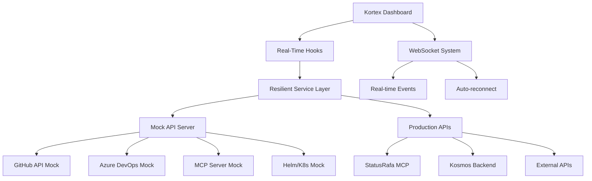

# 

[](https://github.com/rafa-mori/kortex/actions/workflows/pub-docs.yml)
[](LICENSE)
[](https://github.com/rafa-mori/kortex/actions)
[](https://www.typescriptlang.org/)
[](https://nextjs.org/)
[](https://github.com/rafa-mori/kortex/commits)

---

## 🌐 Real-Time DevOps & AI Monitoring Dashboard

**Kortex** is a production-ready, enterprise-grade monitoring dashboard designed for modern development teams. It provides real-time insights into API usage, system health, and development workflows across GitHub, Azure DevOps, Kubernetes, and AI infrastructure.

Built with **Next.js 15**, **TypeScript**, and **Tailwind CSS**, Kortex offers a responsive, real-time interface powered by WebSocket connections and resilient API integrations.

---

## 📋 Table of Contents

- [🚀 Features](#-features)
- [🎯 Use Cases](#-use-cases)
- [🏗️ Architecture](#️-architecture)
- [⚡ Quick Start](#-quick-start)
- [🔧 Installation](#-installation)
- [⚙️ Configuration](#️-configuration)
- [📊 Dashboard Overview](#-dashboard-overview)
- [🔌 Integrations](#-integrations)
- [🛠️ Development](#️-development)
- [🚀 Deployment](#-deployment)
- [🤝 Contributing](#-contributing)
- [📄 License](#-license)

---

## 🚀 Features

### Real-Time Monitoring

- **WebSocket-powered updates** - No page refreshes needed
- **Live API rate limit tracking** for GitHub and Azure DevOps
- **Auto-pause mechanisms** before hitting quota limits
- **Real-time server health monitoring**

### Multi-Platform Integration

- **GitHub** - Repositories, pull requests, actions, and API usage
- **Azure DevOps** - Projects, pipelines, and deployment status
- **Kubernetes/Helm** - Cluster management and release monitoring
- **MCP Servers** - Model Context Protocol server management

### Enterprise-Ready

- **Type-safe TypeScript** codebase with zero compilation errors
- **Responsive design** with dark mode support
- **Resilient fallbacks** for offline/error scenarios
- **Visual indicators** for data source status (real/demo modes)

### Developer Experience

- **Static site generation** for fast deployments
- **Modular architecture** with clean separation of concerns
- **Comprehensive logging** and error handling
- **Hot-reload development** environment

---

## 🎯 Use Cases

### DevOps Teams

- Monitor CI/CD pipeline health across multiple platforms
- Track API quotas before they impact builds
- Visualize deployment status and system metrics
- Manage Kubernetes clusters and Helm releases

### AI/ML Engineers

- Monitor LLM agent execution and resource usage
- Track API costs and usage patterns
- Manage Model Context Protocol servers
- Observe real-time inference metrics

### Backend Engineers

- API observability and rate limit management
- System health monitoring and alerting
- Integration status tracking
- Performance metrics visualization

---

## 🏗️ Architecture



### Core Components

- **Frontend**: Next.js 15 with TypeScript and Tailwind CSS
- **State Management**: React Context API with custom hooks
- **Real-time**: WebSocket connections with automatic reconnection
- **API Layer**: Resilient service layer with fallback mechanisms
- **Development**: Mock API server for local development
- **Production**: Integration with StatusRafa MCP and Kosmos backends

---

## ⚡ Quick Start

```bash
# Clone the repository
git clone https://github.com/rafa-mori/kortex.git
cd kortex

# Install dependencies
npm install

# Start development servers
npm run dev:full
```

This will start both the Next.js application and the mock API server.

**Access points:**

- **Dashboard**: <http://localhost:3000>
- **Mock API**: <http://localhost:3002>

---

## 🔧 Installation

### Prerequisites

- **Node.js** 18.0.0 or higher
- **npm** or **yarn** package manager
- **Git** for version control

### Development Setup

```bash
# 1. Clone and navigate
git clone https://github.com/rafa-mori/kortex.git
cd kortex

# 2. Install dependencies
npm install

# 3. Start mock API server (Terminal 1)
node scripts/mock-api-server.cjs

# 4. Start Next.js application (Terminal 2)
npm run dev

# 5. Access the dashboard
open http://localhost:3000
```

### Production Setup

```bash
# Build for production
npm run build

# Start production server
npm start

# Or generate static site
npm run export
```

---

## ⚙️ Configuration

### Environment Variables

Create a `.env.local` file in the project root:

```env
# API Configuration
NEXT_PUBLIC_API_BASE_URL=http://localhost:3002
NEXT_PUBLIC_WS_URL=ws://localhost:3002/ws

# Production URLs (when ready)
# NEXT_PUBLIC_API_BASE_URL=https://kosmos.statusrafa.com
# NEXT_PUBLIC_WS_URL=wss://kosmos.statusrafa.com/ws

# Optional: GitHub Integration
GITHUB_TOKEN=your_github_token
AZURE_DEVOPS_TOKEN=your_azure_token
```

### Mock API Server

The development environment includes a comprehensive mock API server that simulates real data sources:

```bash
# Start mock server
node scripts/mock-api-server.cjs

# Available endpoints:
# - /api/github/repos
# - /api/github/user
# - /api/azure/projects
# - /api/azure/pipelines
# - /api/mcp/servers
# - /api/mcp/server/:id/health
# - /api/helm/context
# - /api/helm/releases
```

---

## 📊 Dashboard Overview

### Main Dashboard

- **GitHub Integration**: Repository stats, pull requests, and API usage
- **Azure DevOps**: Project overview, pipeline status, and deployment metrics
- **Real-time Indicators**: Live data status and refresh mechanisms
- **KPI Cards**: Key performance indicators with trend analysis

### Servers Management

- **MCP Server Monitoring**: Health status, uptime, and performance metrics
- **CRUD Operations**: Create, update, and delete server configurations
- **Real-time Health Checks**: Automatic server monitoring with alerts

### Analytics Dashboard

- **Aggregated Metrics**: Combined data from GitHub, Azure, and MCP sources
- **Trend Analysis**: Historical data visualization and growth patterns
- **Provider Statistics**: Usage breakdown by service provider
- **Performance Monitoring**: System-wide performance indicators

### Helm/Kubernetes

- **Cluster Management**: Kubernetes namespace and resource monitoring
- **Helm Releases**: Deployment status and release management
- **Resource Monitoring**: Pod status, scaling, and resource usage

---

## 🔌 Integrations

### Supported Platforms

#### GitHub

- Repository management and statistics
- Pull request monitoring
- GitHub Actions status
- API rate limit tracking

#### Azure DevOps

- Project and pipeline overview
- Build and deployment status
- Work item tracking
- API usage monitoring

#### Kubernetes/Helm

- Cluster health monitoring
- Helm release management
- Resource utilization tracking
- Deployment automation

#### MCP (Model Context Protocol)

- Server health monitoring
- Protocol compliance checking
- Performance metrics
- Configuration management

### KUBEX Ecosystem

Kortex is part of the larger KUBEX ecosystem:

- **KbxHorizon**: Go CLI framework for production applications
- **KbxKosmos**: Python MCP server with intelligent routing
- **KbxSynex**: Worker orchestration and prompt crafting
- **StatusRafa**: Real-time telemetry and API unification

---

## 🛠️ Development

### Project Structure

```bash
kortex/
├── src/
│   ├── components/        # UI components
│   ├── pages/            # Next.js pages
│   ├── hooks/            # Custom React hooks
│   ├── context/          # React context providers
│   ├── services/         # API service layer
│   └── types/            # TypeScript type definitions
├── scripts/
│   └── mock-api-server.cjs  # Development mock server
├── docs/                 # Documentation
└── public/              # Static assets
```

### Key Technologies

- **Framework**: Next.js 15 with App Router
- **Language**: TypeScript with strict mode
- **Styling**: Tailwind CSS with dark mode
- **State**: React Context API
- **Real-time**: WebSocket with auto-reconnect
- **Icons**: Lucide React
- **Animation**: Framer Motion

### Development Commands

```bash
# Development
npm run dev              # Start Next.js dev server
npm run dev:mock         # Start mock API server

# Building
npm run build            # Production build
npm run start            # Start production server
npm run export           # Generate static site

# Code Quality
npm run lint             # ESLint checking
npm test                 # Run test suite

# Utilities
npm run clean            # Clean build artifacts
npm run analyze          # Bundle analysis
```

### Testing

```bash
# Unit tests
npm test

# E2E tests
npm run test:e2e

# Test coverage
npm run test:coverage

# API endpoint testing
curl http://localhost:3002/api/github/repos
curl http://localhost:3002/api/mcp/servers
```

---

## 🚀 Deployment

### Static Site Generation

Kortex supports static site generation for fast, reliable deployments:

```bash
# Build static site
npm run build
npm run export

# Deploy to GitHub Pages, Vercel, or Netlify
# Output directory: ./out
```

### Docker Deployment

```dockerfile
FROM node:18-alpine

WORKDIR /app
COPY package*.json ./
RUN npm ci --only=production

COPY . .
RUN npm run build

EXPOSE 3000
CMD ["npm", "start"]
```

### Environment-Specific Configurations

#### Development

- Mock API server on localhost:3002
- Hot reload and debug tools
- Comprehensive error logging

#### Staging

- Connection to staging StatusRafa instance
- Production-like data with test tokens
- Performance monitoring enabled

#### Production

- Direct integration with StatusRafa MCP
- Real API tokens and authentication
- Optimized builds and caching

---

## 🤝 Contributing

We welcome contributions! Please follow these guidelines:

### Getting Started

1. Fork the repository
2. Create a feature branch (`git checkout -b feature/amazing-feature`)
3. Make your changes
4. Run tests and linting (`npm run lint && npm test`)
5. Commit your changes (`git commit -m 'Add amazing feature'`)
6. Push to your branch (`git push origin feature/amazing-feature`)
7. Open a Pull Request

### Development Standards

- **TypeScript**: Strict mode enabled, no `any` types
- **Code Style**: ESLint and Prettier configuration
- **Testing**: Unit tests for new features
- **Documentation**: Update README and docs for changes
- **Commits**: Conventional commit messages

### Areas for Contribution

- 🐛 Bug fixes and error handling improvements
- ✨ New integrations (AWS, GCP, etc.)
- 🎨 UI/UX enhancements and accessibility
- 📚 Documentation and examples
- 🔧 Performance optimizations
- 🧪 Test coverage improvements

---

## 📄 License

MIT License © 2024 Rafael Mori

Permission is hereby granted, free of charge, to any person obtaining a copy
of this software and associated documentation files (the "Software"), to deal
in the Software without restriction, including without limitation the rights
to use, copy, modify, merge, publish, distribute, sublicense, and/or sell
copies of the Software, and to permit persons to whom the Software is
furnished to do so, subject to the following conditions:

The above copyright notice and this permission notice shall be included in all
copies or substantial portions of the Software.

---

## 📞 Contact & Support

- **Author**: Rafael Mori
- **Email**: <faelmori@gmail.com>
- **GitHub**: [@rafa-mori](https://github.com/rafa-mori)
- **Project Issues**: [GitHub Issues](https://github.com/rafa-mori/kortex/issues)

---

## 🌟 Acknowledgments

Built with ❤️ by the KUBEX team

[🌐 Website](https://rafa-mori.dev) · [📚 Docs](./docs) · [🚀 Roadmap](./docs/ROADMAP.md) · [🐛 Issues](https://github.com/rafa-mori/kortex/issues)
