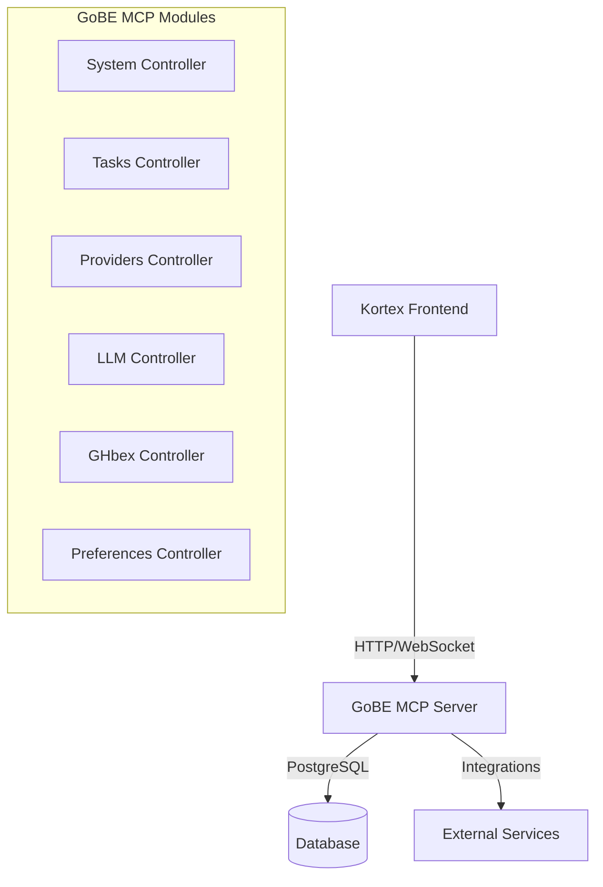

# Plano de Integração Kortex ↔ GoBE - APIs de Produção

## 🎯 Visão Geral

O GoBE evoluiu e se tornou um **MCP completo** (Model Context Protocol Server), fornecendo todas as APIs que o Kortex precisa consumir. O frontend deve ser **100% agnóstico** e apenas consumir essas APIs de produção.

## 🏗️ Arquitetura de Integração



## 📊 Mapeamento de APIs Descobertas

### 🔧 MCP System APIs

| Endpoint | Método | Função | Status API |
|----------|--------|--------|------------|
| `/api/v1/mcp/system/metrics` | GET | Métricas gerais do sistema | ✅ Produção |
| `/api/v1/mcp/system/info` | GET | Informações do sistema | ✅ Produção |
| `/api/v1/mcp/system/cpu-info` | GET | Info de CPU | ✅ Produção |
| `/api/v1/mcp/system/memory-info` | GET | Info de memória | ✅ Produção |
| `/api/v1/mcp/system/disk-info` | GET | Info de disco | ✅ Produção |
| `/api/v1/mcp/system/routes` | GET | Rotas registradas | ✅ Produção |
| `/api/v1/mcp/system/tools` | GET | Ferramentas disponíveis | ✅ Produção |

### 📋 MCP Tasks APIs

| Endpoint | Método | Função | Status API |
|----------|--------|--------|------------|
| `/api/v1/mcp/tasks` | GET | Listar todas as tarefas | ✅ Produção |
| `/api/v1/mcp/tasks/:id` | GET | Obter tarefa por ID | ✅ Produção |
| `/api/v1/mcp/tasks/:id` | DELETE | Deletar tarefa | ✅ Produção |
| `/api/v1/mcp/tasks/active` | GET | Tarefas ativas | ✅ Produção |
| `/api/v1/mcp/tasks/due` | GET | Tarefas vencidas | ✅ Produção |
| `/api/v1/mcp/tasks/provider/:provider` | GET | Tarefas por provider | ✅ Produção |
| `/api/v1/mcp/tasks/:id/running` | POST | Marcar como executando | ✅ Produção |
| `/api/v1/mcp/tasks/:id/completed` | POST | Marcar como completa | ✅ Produção |
| `/api/v1/mcp/tasks/:id/failed` | POST | Marcar como falhou | ✅ Produção |

### 🔌 MCP Providers APIs

| Endpoint | Método | Função | Status API |
|----------|--------|--------|------------|
| `/api/v1/mcp/providers` | GET | Listar providers | ✅ Produção |
| `/api/v1/mcp/providers/:id` | GET | Provider por ID | ✅ Produção |
| `/api/v1/mcp/providers` | POST | Criar provider | ✅ Produção |
| `/api/v1/mcp/providers/:id` | PUT | Atualizar provider | ✅ Produção |
| `/api/v1/mcp/providers/:id` | DELETE | Deletar provider | ✅ Produção |
| `/api/v1/mcp/providers/active` | GET | Providers ativos | ✅ Produção |
| `/api/v1/mcp/providers/org/:org` | GET | Providers por org | ✅ Produção |

### 🤖 MCP LLM APIs

| Endpoint | Método | Função | Status API |
|----------|--------|--------|------------|
| `/api/v1/mcp/llm` | GET | Listar modelos LLM | ✅ Produção |
| `/api/v1/mcp/llm/:id` | GET | Modelo por ID | ✅ Produção |
| `/api/v1/mcp/llm` | POST | Criar modelo | ✅ Produção |
| `/api/v1/mcp/llm/:id` | PUT | Atualizar modelo | ✅ Produção |
| `/api/v1/mcp/llm/:id` | DELETE | Deletar modelo | ✅ Produção |
| `/api/v1/mcp/llm/enabled` | GET | Modelos habilitados | ✅ Produção |

### 🐙 GHbex Integration APIs

| Endpoint | Método | Função | Status API |
|----------|--------|--------|------------|
| `/api/v1/mcp/ghbex` | GET | Status geral GHbex | ✅ Produção |
| `/api/v1/mcp/ghbex/health` | GET | Health check | ✅ Produção |
| `/api/v1/mcp/ghbex/repos/:owner/:repo` | GET | Info do repositório | ✅ Produção |
| `/api/v1/mcp/ghbex/analytics/:owner/:repo` | GET | Analytics do repo | ✅ Produção |
| `/api/v1/mcp/ghbex/productivity/:owner/:repo` | GET | Métricas produtividade | ✅ Produção |
| `/api/v1/mcp/ghbex/intelligence/:owner/:repo` | GET | Intelligence insights | ✅ Produção |
| `/api/v1/mcp/ghbex/automation/:owner/:repo` | GET | Automações ativas | ✅ Produção |

## 🔄 Tipos de Dados (Go → TypeScript)

### Task Model

```typescript
// src/types/GoBETypes.tsx
export interface TaskModel {
  id: string;
  mcp_provider: string;
  target_task: string;
  last_synced?: Date;
  created_at?: string;
  created_by?: string;
  updated_at?: string;
  updated_by?: string;
  task_type: 'pull' | 'push' | 'sync';
  task_schedule: 'cron' | 'manual' | 'event';
  task_expression: string;
  task_command_type: string;
  task_method: 'GET' | 'POST' | 'PUT' | 'DELETE' | 'PATCH';
  task_api_endpoint?: string;
  task_payload?: Record<string, any>;
  task_headers?: Record<string, any>;
  task_retries: number;
  task_timeout: number;
  task_status: 'PENDING' | 'RUNNING' | 'COMPLETED' | 'FAILED' | 'CANCELLED';
  task_next_run?: Date;
  task_last_run?: Date;
  task_last_run_status: string;
  task_last_run_message: string;
  task_command?: string;
  task_activated: boolean;
  task_config?: Record<string, any>;
  task_tags?: string[];
  task_priority: number;
  task_notes?: string;
  active: boolean;
}

export interface ProviderModel {
  id: string;
  provider: string;
  org_or_group: string;
  config: Record<string, any>;
  created_at?: string;
  updated_at?: string;
  created_by?: string;
  updated_by?: string;
}

export interface SystemMetrics {
  cpu: {
    usage: number;
    cores: number;
    model: string;
  };
  memory: {
    total: number;
    used: number;
    free: number;
    usage_percent: number;
  };
  disk: {
    total: number;
    used: number;
    free: number;
    usage_percent: number;
  };
  system: {
    uptime: number;
    load_average: number[];
    processes: number;
  };
}
```

## 🛠️ Implementação da Camada de Serviços

### API Client Base

```typescript
// src/services/GoBEApiClient.ts
export class GoBEApiClient {
  private baseURL: string;
  private timeout = 10000;

  constructor(baseURL?: string) {
    this.baseURL = baseURL || process.env.NEXT_PUBLIC_GOBE_API_URL || 'http://localhost:8080';
  }

  private async request<T>(
    endpoint: string,
    options: RequestInit = {}
  ): Promise<T> {
    const url = `${this.baseURL}${endpoint}`;

    const config: RequestInit = {
      ...options,
      headers: {
        'Content-Type': 'application/json',
        ...options.headers,
      },
    };

    const response = await fetch(url, config);

    if (!response.ok) {
      throw new Error(`GoBE API Error: ${response.status} ${response.statusText}`);
    }

    return response.json();
  }

  // System APIs
  async getSystemMetrics(): Promise<SystemMetrics> {
    return this.request<SystemMetrics>('/api/v1/mcp/system/metrics');
  }

  async getSystemInfo(): Promise<any> {
    return this.request('/api/v1/mcp/system/info');
  }

  // Tasks APIs
  async getAllTasks(): Promise<TaskModel[]> {
    return this.request<TaskModel[]>('/api/v1/mcp/tasks');
  }

  async getTaskById(id: string): Promise<TaskModel> {
    return this.request<TaskModel>(`/api/v1/mcp/tasks/${id}`);
  }

  async getActiveTasks(): Promise<TaskModel[]> {
    return this.request<TaskModel[]>('/api/v1/mcp/tasks/active');
  }

  async getTasksDue(): Promise<TaskModel[]> {
    return this.request<TaskModel[]>('/api/v1/mcp/tasks/due');
  }

  async markTaskAsRunning(id: string): Promise<void> {
    return this.request(`/api/v1/mcp/tasks/${id}/running`, {
      method: 'POST',
    });
  }

  async markTaskAsCompleted(id: string): Promise<void> {
    return this.request(`/api/v1/mcp/tasks/${id}/completed`, {
      method: 'POST',
    });
  }

  async markTaskAsFailed(id: string): Promise<void> {
    return this.request(`/api/v1/mcp/tasks/${id}/failed`, {
      method: 'POST',
    });
  }

  // Providers APIs
  async getAllProviders(): Promise<ProviderModel[]> {
    return this.request<ProviderModel[]>('/api/v1/mcp/providers');
  }

  async getActiveProviders(): Promise<ProviderModel[]> {
    return this.request<ProviderModel[]>('/api/v1/mcp/providers/active');
  }

  async getProviderById(id: string): Promise<ProviderModel> {
    return this.request<ProviderModel>(`/api/v1/mcp/providers/${id}`);
  }

  // GHbex APIs
  async getGHbexHealth(): Promise<any> {
    return this.request('/api/v1/mcp/ghbex/health');
  }

  async getRepoAnalytics(owner: string, repo: string): Promise<any> {
    return this.request(`/api/v1/mcp/ghbex/analytics/${owner}/${repo}`);
  }

  async getRepoProductivity(owner: string, repo: string): Promise<any> {
    return this.request(`/api/v1/mcp/ghbex/productivity/${owner}/${repo}`);
  }
}

export const goBEApiClient = new GoBEApiClient();
```

### Service Layer com Estado Reativo

```typescript
// src/services/MCPDataService.ts
import { goBEApiClient } from './GoBEApiClient';
import { TaskModel, ProviderModel, SystemMetrics } from '../types/GoBETypes';

export class MCPDataService {
  private refreshInterval = 30000; // 30 segundos
  private intervals: Map<string, NodeJS.Timeout> = new Map();

  // Sistema de callbacks para atualizações
  private subscribers: Map<string, Set<(data: any) => void>> = new Map();

  subscribe(event: string, callback: (data: any) => void) {
    if (!this.subscribers.has(event)) {
      this.subscribers.set(event, new Set());
    }
    this.subscribers.get(event)?.add(callback);
  }

  unsubscribe(event: string, callback: (data: any) => void) {
    this.subscribers.get(event)?.delete(callback);
  }

  private emit(event: string, data: any) {
    this.subscribers.get(event)?.forEach(callback => callback(data));
  }

  // Auto-refresh de dados
  startAutoRefresh() {
    this.intervals.set('system-metrics', setInterval(async () => {
      try {
        const metrics = await goBEApiClient.getSystemMetrics();
        this.emit('system-metrics-updated', metrics);
      } catch (error) {
        this.emit('error', { type: 'system-metrics', error });
      }
    }, this.refreshInterval));

    this.intervals.set('tasks', setInterval(async () => {
      try {
        const tasks = await goBEApiClient.getAllTasks();
        this.emit('tasks-updated', tasks);
      } catch (error) {
        this.emit('error', { type: 'tasks', error });
      }
    }, this.refreshInterval));

    this.intervals.set('providers', setInterval(async () => {
      try {
        const providers = await goBEApiClient.getAllProviders();
        this.emit('providers-updated', providers);
      } catch (error) {
        this.emit('error', { type: 'providers', error });
      }
    }, this.refreshInterval));
  }

  stopAutoRefresh() {
    this.intervals.forEach(interval => clearInterval(interval));
    this.intervals.clear();
  }

  // Métodos para obter dados iniciais
  async getInitialData() {
    try {
      const [systemMetrics, tasks, providers] = await Promise.all([
        goBEApiClient.getSystemMetrics(),
        goBEApiClient.getAllTasks(),
        goBEApiClient.getAllProviders(),
      ]);

      return { systemMetrics, tasks, providers };
    } catch (error) {
      throw new Error(`Failed to load initial data: ${error.message}`);
    }
  }
}

export const mcpDataService = new MCPDataService();
```

## 🔄 Integração com Context Existente

### Atualização do AppContext

```typescript
// src/context/AppContext.tsx - ATUALIZAÇÃO
import { mcpDataService, goBEApiClient } from '../services';
import { TaskModel, ProviderModel, SystemMetrics } from '../types/GoBETypes';

export interface AppContextType {
  // Dados do GoBE
  systemMetrics: SystemMetrics | null;
  tasks: TaskModel[];
  providers: ProviderModel[];

  // Estados
  isConnected: boolean;
  isLoading: boolean;
  error: string | null;
  lastUpdate: Date | null;

  // Ações
  refreshData: () => Promise<void>;
  startRealTimeUpdates: () => void;
  stopRealTimeUpdates: () => void;

  // Task actions
  markTaskAsRunning: (taskId: string) => Promise<void>;
  markTaskAsCompleted: (taskId: string) => Promise<void>;
  markTaskAsFailed: (taskId: string) => Promise<void>;
}

export const AppProvider = ({ children }: { children: ReactNode }) => {
  const [systemMetrics, setSystemMetrics] = useState<SystemMetrics | null>(null);
  const [tasks, setTasks] = useState<TaskModel[]>([]);
  const [providers, setProviders] = useState<ProviderModel[]>([]);
  const [isLoading, setIsLoading] = useState(false);
  const [error, setError] = useState<string | null>(null);
  const [isConnected, setIsConnected] = useState(false);
  const [lastUpdate, setLastUpdate] = useState<Date | null>(null);

  useEffect(() => {
    loadInitialData();
    setupSubscriptions();

    return () => {
      mcpDataService.stopAutoRefresh();
    };
  }, []);

  const loadInitialData = async () => {
    setIsLoading(true);
    try {
      const data = await mcpDataService.getInitialData();
      setSystemMetrics(data.systemMetrics);
      setTasks(data.tasks);
      setProviders(data.providers);
      setIsConnected(true);
      setLastUpdate(new Date());
    } catch (err) {
      setError(err.message);
      setIsConnected(false);
    } finally {
      setIsLoading(false);
    }
  };

  const setupSubscriptions = () => {
    mcpDataService.subscribe('system-metrics-updated', (metrics) => {
      setSystemMetrics(metrics);
      setLastUpdate(new Date());
    });

    mcpDataService.subscribe('tasks-updated', (newTasks) => {
      setTasks(newTasks);
      setLastUpdate(new Date());
    });

    mcpDataService.subscribe('providers-updated', (newProviders) => {
      setProviders(newProviders);
      setLastUpdate(new Date());
    });

    mcpDataService.subscribe('error', (errorData) => {
      setError(`${errorData.type}: ${errorData.error.message}`);
    });
  };

  const startRealTimeUpdates = () => {
    mcpDataService.startAutoRefresh();
  };

  const stopRealTimeUpdates = () => {
    mcpDataService.stopAutoRefresh();
  };

  const markTaskAsRunning = async (taskId: string) => {
    try {
      await goBEApiClient.markTaskAsRunning(taskId);
      await refreshData(); // Refresh para pegar estado atualizado
    } catch (err) {
      setError(`Failed to mark task as running: ${err.message}`);
    }
  };

  // ... outros métodos similares

  const value: AppContextType = {
    systemMetrics,
    tasks,
    providers,
    isConnected,
    isLoading,
    error,
    lastUpdate,
    refreshData: loadInitialData,
    startRealTimeUpdates,
    stopRealTimeUpdates,
    markTaskAsRunning,
    markTaskAsCompleted,
    markTaskAsFailed,
  };

  return (
    <AppContext.Provider value={value}>
      {children}
    </AppContext.Provider>
  );
};
```

## 🚀 Implementação Imediata

### Próximos Passos (Semana 1)

1. **Configurar Base URL do GoBE**
   - Adicionar variável de ambiente `NEXT_PUBLIC_GOBE_API_URL`
   - Testar conectividade com GoBE local

2. **Implementar GoBEApiClient**
   - Client HTTP base com retry/timeout
   - Mapeamento de todos os endpoints descobertos

3. **Atualizar Tipos TypeScript**
   - Converter modelos Go para interfaces TypeScript
   - Manter compatibilidade com tipos existentes

4. **Integrar com Context Existente**
   - Substituir dados mock por dados reais do GoBE
   - Manter backward compatibility

### Configuração de Desenvolvimento

```typescript
// .env.local
NEXT_PUBLIC_GOBE_API_URL=http://localhost:8080
NEXT_PUBLIC_ENABLE_MOCK_DATA=false
NEXT_PUBLIC_REFRESH_INTERVAL=30000
```

## 🎯 Benefícios da Integração

1. **Dados Reais**: Kortex passa a consumir dados reais do MCP
2. **Sincronização**: Updates em tempo real via polling inteligente
3. **Escalabilidade**: GoBE handle toda a lógica de negócio
4. **Agnóstico**: Kortex fica 100% frontend, sem lógica de domínio
5. **Produção Ready**: APIs já estão em produção no GoBE

## 📊 Métricas de Sucesso

- **Latência**: < 500ms para requests do GoBE
- **Disponibilidade**: 99%+ uptime na integração
- **Dados**: 100% dos dados vindos do GoBE (zero mock)
- **Real-time**: Updates < 30s de delay
- **Performance**: Sem degradação no frontend

---

**Status**: 🔄 Pronto para implementação
**Prioridade**: 🔥 Alta - APIs já estão funcionais no GoBE
