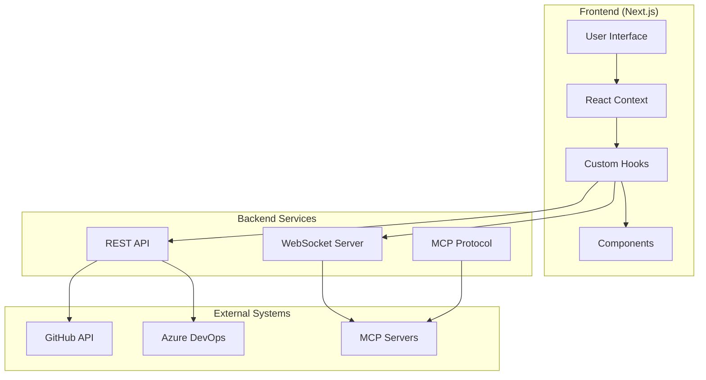
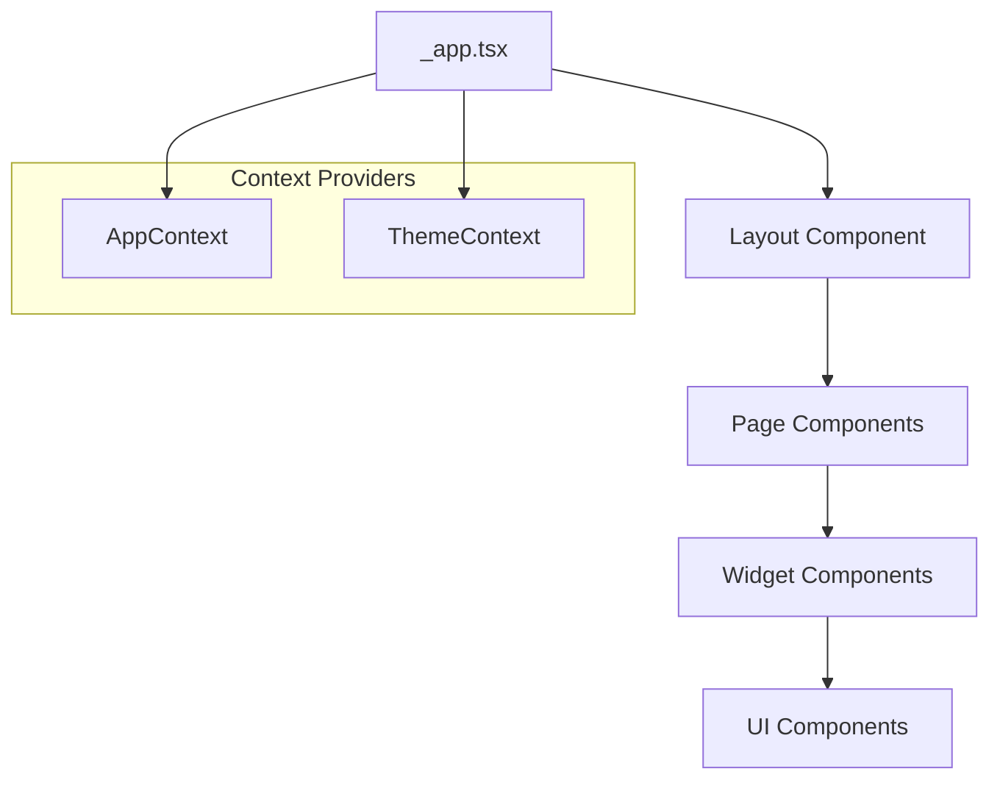
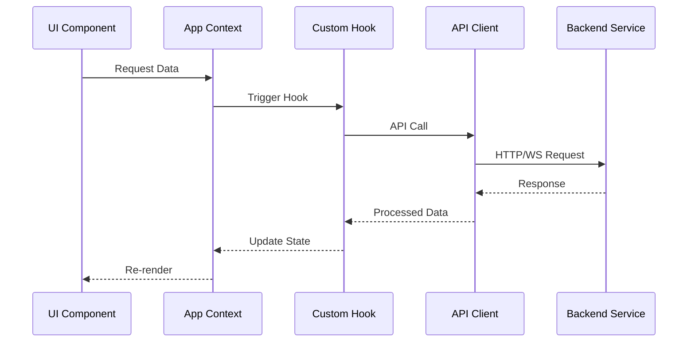
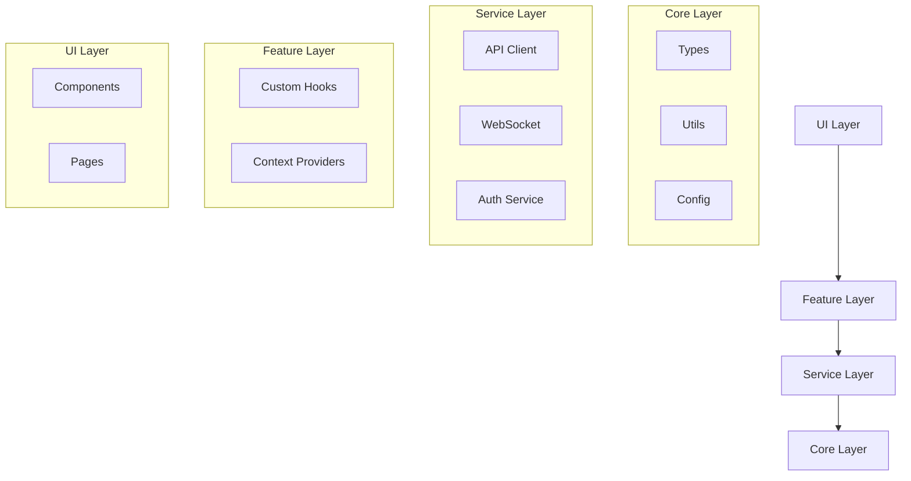
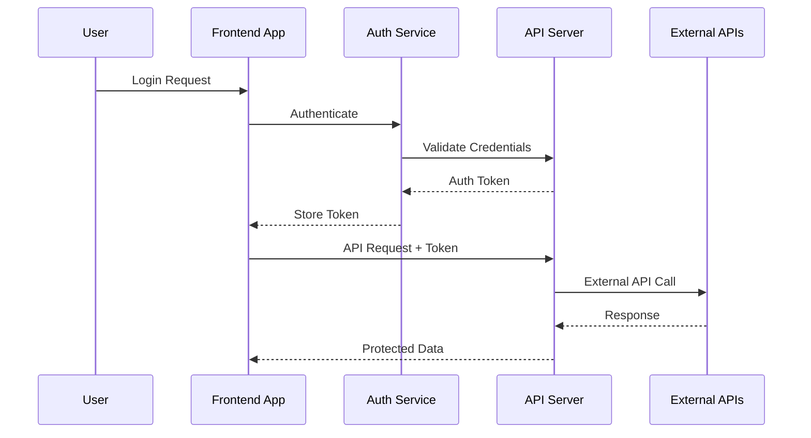

# Architecture

Comprehensive overview of Pulse's architectural design, patterns, and technical decisions.

## 🏗️ System Architecture

### High-Level Overview

Pulsefollows a modern web application architecture with clear separation of concerns:



### Core Components

***Frontend Layer***

- **Next.js Framework**: React-based framework with App Router and Pages Router hybrid
- **TypeScript**: Strict typing for better developer experience and runtime safety
- **Tailwind CSS**: Utility-first CSS framework with dark mode support
- **React Context**: Global state management for application data

***Service Layer***

- **REST API**: RESTful endpoints for CRUD operations
- **WebSocket**: Real-time communication for live updates
- **MCP Protocol**: Model Context Protocol integration for AI server management

***Integration Layer***

- **GitHub API**: Repository monitoring and Actions integration
- **Azure DevOps**: Pipeline and work item management
- **External MCP Servers**: AI model and tool integrations

## 🧩 Component Architecture

### Component Hierarchy



### Component Categories

**Layout Components** (`src/components/Layout/`)

- `Layout.tsx`: Main application layout with sidebar and header
- `Header.tsx`: Top navigation and user controls
- `Sidebar.tsx`: Navigation menu and quick actions

**Feature Components** (`src/components/`)

- `Dashboard/`: Dashboard-specific widgets and views
- `MCP/`: MCP server management and configuration
- `UI/`: Reusable interface components

**Page Components** (`src/pages/`)

- Route-based components using Next.js file-based routing
- Hybrid App Router + Pages Router for flexibility

### Data Flow Architecture



## 📊 State Management

### Context Architecture

***AppContext Structure***

```typescript
interface AppContextValue {
  // Server Management
  servers: Server[];
  connectionStatus: ConnectionStatus;

  // Task Management
  tasks: Task[];
  taskQueue: TaskQueue;

  // Notification System
  notifications: Notification[];

  // Logging and Monitoring
  logs: LogEntry[];
  metrics: MetricsData;

  // Actions
  connectToServer: (serverId: string) => Promise<void>;
  disconnectFromServer: (serverId: string) => Promise<void>;
  addTask: (task: Task) => void;
  updateTask: (taskId: string, updates: Partial<Task>) => void;
  addNotification: (notification: Notification) => void;
  removeNotification: (notificationId: string) => void;
}
```

***State Normalization***

```typescript
// Normalized state structure for efficient updates
interface NormalizedState {
  servers: {
    byId: Record<string, Server>;
    allIds: string[];
  };
  tasks: {
    byId: Record<string, Task>;
    allIds: string[];
    byServer: Record<string, string[]>;
  };
  notifications: {
    byId: Record<string, Notification>;
    allIds: string[];
    byType: Record<NotificationType, string[]>;
  };
}
```

### State Update Patterns

***Immutable Updates***

```typescript
// Server status update example
const updateServerStatus = (serverId: string, status: ServerStatus) => {
  setServers(prevServers =>
    prevServers.map(server =>
      server.id === serverId
        ? { ...server, status }
        : server
    )
  );
};

// Optimistic updates for better UX
const connectToServer = async (serverId: string) => {
  // Optimistic update
  updateServerStatus(serverId, 'connecting');

  try {
    await apiClient.connectToServer(serverId);
    updateServerStatus(serverId, 'connected');
  } catch (error) {
    updateServerStatus(serverId, 'error');
    addNotification({
      type: 'error',
      title: 'Connection Failed',
      message: error.message,
    });
  }
};
```

## 🔄 Real-time Architecture

### WebSocket Integration

***Connection Management***

```typescript
class WebSocketManager {
  private connections: Map<string, WebSocket> = new Map();
  private reconnectTimers: Map<string, NodeJS.Timeout> = new Map();

  connect(endpoint: string, options: WSOptions): Promise<WebSocket> {
    return new Promise((resolve, reject) => {
      const ws = new WebSocket(endpoint);

      ws.onopen = () => {
        this.connections.set(endpoint, ws);
        this.setupHeartbeat(endpoint);
        resolve(ws);
      };

      ws.onclose = () => {
        this.handleDisconnection(endpoint);
      };

      ws.onerror = (error) => {
        reject(error);
      };

      ws.onmessage = (event) => {
        this.handleMessage(endpoint, event.data);
      };
    });
  }

  private setupHeartbeat(endpoint: string): void {
    const ws = this.connections.get(endpoint);
    if (!ws) return;

    const interval = setInterval(() => {
      if (ws.readyState === WebSocket.OPEN) {
        ws.send(JSON.stringify({ type: 'ping' }));
      }
    }, 30000); // 30 seconds

    // Store interval for cleanup
    this.heartbeatIntervals.set(endpoint, interval);
  }

  private handleDisconnection(endpoint: string): void {
    this.connections.delete(endpoint);
    this.scheduleReconnection(endpoint);
  }
}
```

***Event-Driven Updates***

```typescript
// Real-time event handling
interface WSMessage {
  type: string;
  serverId?: string;
  data: any;
  timestamp: number;
}

const handleWebSocketMessage = (message: WSMessage) => {
  switch (message.type) {
    case 'server_status_update':
      updateServerStatus(message.serverId!, message.data.status);
      break;

    case 'new_log_entry':
      addLogEntry(message.data);
      break;

    case 'metrics_update':
      updateMetrics(message.serverId!, message.data);
      break;

    case 'task_completed':
      updateTaskStatus(message.data.taskId, 'completed');
      break;

    default:
      console.warn('Unknown message type:', message.type);
  }
};
```

## 🔧 API Design

### RESTful Endpoints

***Resource-Based URLs***

```typescript
// Server management endpoints
GET    /api/v1/servers              // List all servers
POST   /api/v1/servers              // Create new server
GET    /api/v1/servers/:id          // Get server details
PUT    /api/v1/servers/:id          // Update server
DELETE /api/v1/servers/:id          // Delete server

// Server actions
POST   /api/v1/servers/:id/connect     // Connect to server
POST   /api/v1/servers/:id/disconnect  // Disconnect from server
GET    /api/v1/servers/:id/health      // Health check
GET    /api/v1/servers/:id/metrics     // Get metrics

// Task management
GET    /api/v1/tasks                // List tasks
POST   /api/v1/tasks                // Create task
GET    /api/v1/tasks/:id            // Get task details
PUT    /api/v1/tasks/:id            // Update task
DELETE /api/v1/tasks/:id            // Delete task
POST   /api/v1/tasks/:id/execute    // Execute task
```

***Response Patterns***

```typescript
// Standard response wrapper
interface ApiResponse<T> {
  success: boolean;
  data?: T;
  error?: {
    code: string;
    message: string;
    details?: any;
  };
  meta?: {
    pagination?: PaginationInfo;
    timestamp: string;
    requestId: string;
  };
}

// Error handling
interface ApiError {
  code: string;
  message: string;
  statusCode: number;
  details?: Record<string, any>;
}

// Success responses
interface PaginatedResponse<T> {
  items: T[];
  pagination: {
    page: number;
    limit: number;
    total: number;
    hasNext: boolean;
    hasPrevious: boolean;
  };
}
```

### API Client Architecture

***Centralized Client***

```typescript
class ApiClient {
  private baseUrl: string;
  private defaultHeaders: Record<string, string>;

  constructor(config: ApiClientConfig) {
    this.baseUrl = config.baseUrl;
    this.defaultHeaders = {
      'Content-Type': 'application/json',
      ...config.headers,
    };
  }

  async request<T>(
    method: string,
    endpoint: string,
    options: RequestOptions = {}
  ): Promise<ApiResponse<T>> {
    const url = `${this.baseUrl}${endpoint}`;
    const headers = { ...this.defaultHeaders, ...options.headers };

    try {
      const response = await fetch(url, {
        method,
        headers,
        body: options.body ? JSON.stringify(options.body) : undefined,
      });

      if (!response.ok) {
        throw new ApiError(
          `HTTP ${response.status}`,
          response.statusText,
          response.status
        );
      }

      return await response.json();
    } catch (error) {
      throw this.handleError(error);
    }
  }

  // Convenience methods
  get<T>(endpoint: string, options?: RequestOptions): Promise<ApiResponse<T>> {
    return this.request<T>('GET', endpoint, options);
  }

  post<T>(endpoint: string, data?: any, options?: RequestOptions): Promise<ApiResponse<T>> {
    return this.request<T>('POST', endpoint, { ...options, body: data });
  }
}
```

## 🏛️ Module Architecture

### Feature-Based Organization

```plaintext
src/
├── components/           # UI Components
│   ├── Layout/          # Layout components
│   ├── Dashboard/       # Dashboard features
│   ├── MCP/            # MCP-specific components
│   └── UI/             # Reusable UI components
├── context/            # React Context providers
├── hooks/              # Custom React hooks
├── lib/                # Utility libraries
├── pages/              # Next.js pages
├── services/           # Business logic services
├── types/              # TypeScript type definitions
└── utils/              # Pure utility functions
```

### Dependency Management

***Layered Dependencies***



***Import Patterns***

```typescript
// Barrel exports for clean imports
// types/index.ts
export * from './server';
export * from './task';
export * from './notification';

// Usage
import { Server, Task, Notification } from '@/types';

// Service dependencies
// services/serverService.ts
import { ApiClient } from '@/lib/api';
import { Server, CreateServerRequest } from '@/types';

export class ServerService {
  constructor(private apiClient: ApiClient) {}

  async getServers(): Promise<Server[]> {
    const response = await this.apiClient.get<Server[]>('/servers');
    return response.data || [];
  }
}
```

## 🔒 Security Architecture

### Authentication Flow



### Token Management

```typescript
class TokenManager {
  private static instance: TokenManager;
  private tokens: Map<string, TokenInfo> = new Map();

  setToken(service: string, token: string, expiresAt?: Date): void {
    this.tokens.set(service, {
      value: this.encrypt(token),
      expiresAt,
      createdAt: new Date(),
    });
  }

  getToken(service: string): string | null {
    const tokenInfo = this.tokens.get(service);
    if (!tokenInfo) return null;

    if (tokenInfo.expiresAt && tokenInfo.expiresAt < new Date()) {
      this.tokens.delete(service);
      return null;
    }

    return this.decrypt(tokenInfo.value);
  }

  private encrypt(value: string): string {
    // Implement encryption logic
    return btoa(value); // Simple base64 for demo
  }

  private decrypt(value: string): string {
    // Implement decryption logic
    return atob(value); // Simple base64 for demo
  }
}
```

---

!!! info "Architecture Principles"
    - **Separation of Concerns**: Clear boundaries between layers
    - **Single Responsibility**: Each module has one primary purpose
    - **Dependency Injection**: Services depend on abstractions, not concretions
    - **Immutable State**: State updates through pure functions
    - **Error Boundaries**: Graceful error handling at all levels
    - **Performance**: Lazy loading and efficient re-rendering patterns
