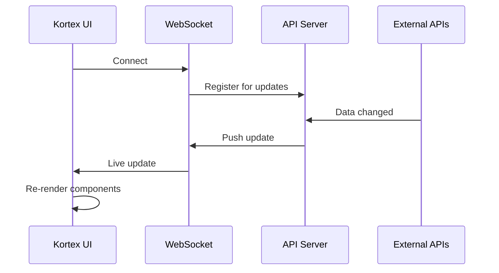
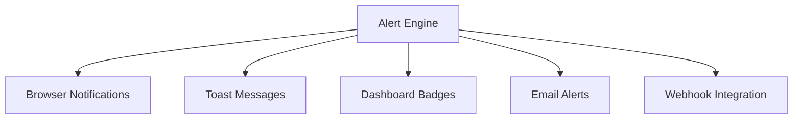
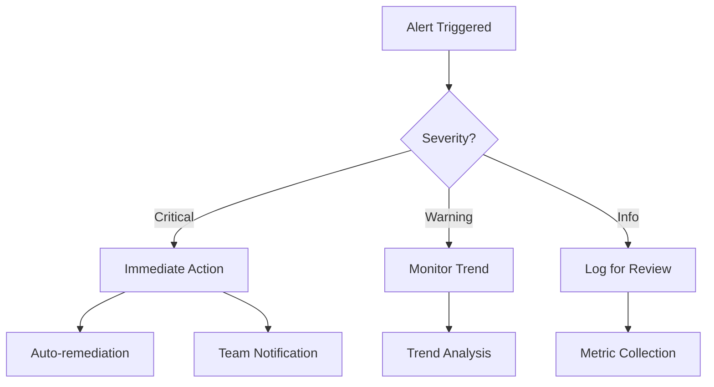

# Real-time Monitoring

Kortex provides comprehensive real-time monitoring capabilities across your DevOps and AI infrastructure. This guide covers how to effectively use and configure real-time features.

## 🚀 WebSocket-Powered Updates

### Instant Data Synchronization

Kortex uses WebSocket connections to deliver real-time updates without requiring page refreshes:



### Connection Management

The WebSocket system automatically handles:

- **Auto-reconnection**: Reconnects if connection is lost
- **Heartbeat monitoring**: Keeps connection alive
- **Exponential backoff**: Smart retry strategy
- **Fallback polling**: Falls back to periodic refresh if WebSocket fails

## 📊 Monitoring Dashboards

### Main Dashboard

The central monitoring hub displays:

#### GitHub Integration

- **Repository Activity**: Real-time commits, pull requests, issues
- **API Usage**: Current rate limit status and usage patterns
- **Workflow Status**: GitHub Actions build and deployment status
- **Contributor Activity**: Live team collaboration metrics

#### Azure DevOps Integration

- **Pipeline Monitoring**: Build and release pipeline status
- **Work Item Tracking**: Sprint progress and task completion
- **Test Results**: Live test execution and coverage reports
- **Deployment Status**: Production deployment health

#### System Health

- **Server Uptime**: MCP server availability and response times
- **Resource Usage**: Memory, CPU, and network utilization
- **Error Rates**: Real-time error tracking and alerting
- **Performance Metrics**: Response times and throughput

### Specialized Views

#### Server Management Dashboard

Monitor your MCP (Model Context Protocol) servers:

```typescript
// Example server health monitoring
interface ServerHealth {
  id: string;
  name: string;
  status: 'online' | 'offline' | 'degraded';
  responseTime: number;
  uptime: number;
  lastCheck: Date;
  errorRate: number;
}
```

Features:

- **Health Checks**: Automated server availability monitoring
- **Performance Tracking**: Response time and throughput metrics
- **Configuration Management**: Live configuration updates
- **Log Streaming**: Real-time server log monitoring

#### Analytics Dashboard

Advanced analytics with real-time data processing:

- **Trend Analysis**: Live trend calculations and projections
- **Cross-platform Metrics**: Aggregated data from all sources
- **Alert Monitoring**: Real-time threshold monitoring
- **Performance Insights**: Automated optimization suggestions

## 🔔 Alert System

### Real-time Notifications

Kortex provides intelligent alerting for critical events:

#### Alert Types

| Alert Level | Trigger | Example |
|-------------|---------|---------|
| **Critical** | System failure | Server down, API unavailable |
| **Warning** | Performance degradation | High response times, rate limits |
| **Info** | Status changes | Deployment completed, new PR |
| **Success** | Positive events | Tests passed, deployment successful |

#### Notification Channels



### Alert Configuration

#### Threshold Settings

```yaml
# Example alert configuration
alerts:
  api_rate_limit:
    warning: 80%    # Warn at 80% usage
    critical: 95%   # Critical at 95% usage
  
  server_response_time:
    warning: 500ms  # Warn if response > 500ms
    critical: 2000ms # Critical if response > 2s
  
  error_rate:
    warning: 5%     # Warn if error rate > 5%
    critical: 15%   # Critical if error rate > 15%
```

## 📈 Performance Monitoring

### API Rate Limit Tracking

Intelligent rate limit management:

#### GitHub API Monitoring

- **Rate Limit Status**: Current usage vs. available quota
- **Reset Timing**: Time until rate limit resets
- **Auto-pause**: Automatically pause requests before hitting limits
- **Usage Optimization**: Smart request scheduling

#### Azure DevOps Monitoring

- **Organization Limits**: Track org-level rate limits
- **Project-specific**: Monitor per-project usage
- **Burst Handling**: Manage traffic spikes efficiently

### Real-time Metrics

#### System Performance

```typescript
interface PerformanceMetrics {
  timestamp: Date;
  apiLatency: {
    github: number;
    azure: number;
    mcp: number;
  };
  throughput: {
    requestsPerSecond: number;
    dataPointsPerMinute: number;
  };
  errorRates: {
    network: number;
    authentication: number;
    rateLimit: number;
  };
}
```

#### Data Freshness Indicators

- **Last Update**: Timestamp of most recent data
- **Update Frequency**: How often data refreshes
- **Data Source**: Real vs. demo vs. cached data
- **Sync Status**: Connection health indicators

## 🔧 Configuration Options

### Update Intervals

Customize refresh rates based on your needs:

```typescript
interface UpdateConfig {
  dashboard: {
    defaultInterval: 300000; // 5 minutes
    minInterval: 30000;      // 30 seconds
    maxInterval: 3600000;    // 1 hour
  };
  servers: {
    healthChecks: 180000;    // 3 minutes
    logStreaming: 5000;      // 5 seconds
  };
  alerts: {
    criticalCheck: 30000;    // 30 seconds
    warningCheck: 60000;     // 1 minute
  };
}
```

### WebSocket Settings

Configure real-time connection behavior:

```yaml
websocket:
  reconnect:
    enabled: true
    maxAttempts: 10
    backoff:
      initial: 1000ms
      max: 30000ms
      multiplier: 1.5
  
  heartbeat:
    interval: 30000ms
    timeout: 10000ms
  
  compression: true
  bufferSize: 1024kb
```

## 🎯 Best Practices

### Efficient Monitoring

#### Optimize Update Frequencies

- **Critical Systems**: 30-60 second intervals
- **General Monitoring**: 3-5 minute intervals
- **Historical Data**: 15-30 minute intervals
- **Archived Metrics**: Hourly or daily updates

#### Resource Management

```typescript
// Example: Intelligent polling strategy
class SmartPoller {
  private adjustInterval(errorRate: number, responseTime: number) {
    if (errorRate > 0.1) {
      return this.baseInterval * 2; // Slower when errors occur
    }
    if (responseTime > 1000) {
      return this.baseInterval * 1.5; // Slower for slow responses
    }
    return this.baseInterval; // Normal interval
  }
}
```

### Alert Management

#### Prevent Alert Fatigue

- **Threshold Tuning**: Adjust thresholds based on historical data
- **Alert Grouping**: Combine related alerts to reduce noise
- **Escalation Rules**: Progressive alert severity
- **Snooze Options**: Temporary alert suppression

#### Alert Response



## 📱 Mobile Responsiveness

### Responsive Design

Kortex adapts monitoring displays for different screen sizes:

#### Mobile Optimizations

- **Simplified Layouts**: Essential metrics only
- **Touch-friendly**: Large buttons and touch targets
- **Swipe Navigation**: Intuitive gesture controls
- **Offline Support**: Cached data when connectivity is poor

#### Progressive Enhancement

- **Core Features**: Available on all devices
- **Enhanced Views**: Additional features on larger screens
- **Performance**: Optimized for each device type

## 🔍 Troubleshooting

### Common Issues

#### WebSocket Connection Problems

```bash
# Check WebSocket connectivity
curl -i -N -H "Connection: Upgrade" \
  -H "Upgrade: websocket" \
  -H "Sec-WebSocket-Key: SGVsbG8sIHdvcmxkIQ==" \
  -H "Sec-WebSocket-Version: 13" \
  http://localhost:3002/ws
```

#### Performance Issues

- **High CPU Usage**: Reduce update frequencies
- **Memory Leaks**: Check for WebSocket connection buildup
- **Network Congestion**: Implement request queuing

#### Data Inconsistencies

- **Cache Issues**: Clear browser cache and restart
- **Time Synchronization**: Ensure server clocks are synchronized
- **Rate Limiting**: Check if hitting API limits

### Debugging Tools

#### Browser Developer Tools

```javascript
// Enable debug logging
localStorage.setItem('kortex:debug', 'true');

// Monitor WebSocket messages
window.addEventListener('message', (event) => {
  console.log('WebSocket message:', event.data);
});

// Performance monitoring
performance.mark('data-fetch-start');
// ... API call ...
performance.mark('data-fetch-end');
performance.measure('data-fetch', 'data-fetch-start', 'data-fetch-end');
```

---

*Next: Learn about [marker generation](generation.md) or explore [configuration options](../guide/configuration.md).*
