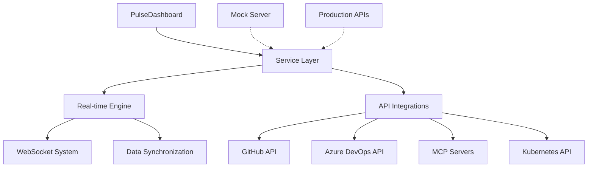
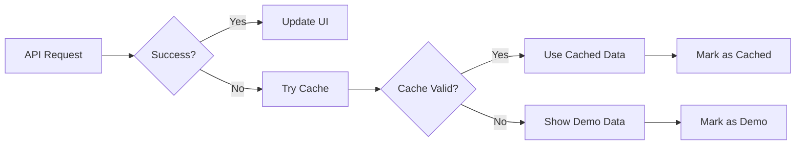

# Basic Concepts

Understanding the core concepts behind Pulse will help you make the most of its monitoring and management capabilities.

## 🏗️ Architecture Overview

Pulsefollows a modular architecture designed for scalability and maintainability:



## 🔧 Core Components

### Dashboard Layer

The **frontend interface** built with Next.js and TypeScript:

- **React Components**: Modular UI components
- **Context Management**: Global state with React Context
- **Real-time Updates**: WebSocket-powered live data
- **Responsive Design**: Works across all devices

### Service Layer

The **middleware** that handles data flow and API communication:

- **Resilient Services**: Automatic retry and fallback mechanisms
- **Data Transformation**: Converts raw API data to UI-friendly formats
- **Caching Strategy**: Intelligent data caching for performance
- **Error Boundaries**: Graceful error handling and recovery

### Integration Layer

**External API connections** for data sources:

- **GitHub Integration**: Repository stats, pull requests, actions
- **Azure DevOps**: Projects, pipelines, work items
- **MCP Protocol**: Model Context Protocol server management
- **Kubernetes**: Cluster monitoring and Helm release management

## 📊 Data Flow

### Real-time Data Pipeline

1. **Data Sources** → External APIs (GitHub, Azure, MCP, K8s)
2. **API Layer** → Service layer processes and validates data
3. **WebSocket** → Real-time updates pushed to frontend
4. **UI Update** → Components re-render with new data
5. **User Feedback** → Visual indicators show data freshness

### Fallback Mechanism



## 🔌 Integration Types

### GitHub Integration

**Purpose**: Monitor development workflow and API usage

**Data Sources**:

- Repository statistics and metadata
- Pull request status and reviews
- GitHub Actions workflow status
- API rate limit tracking
- Contributor activity

**Real-time Features**:

- Live pull request updates
- Action workflow notifications
- Rate limit warnings
- Repository event streams

### Azure DevOps Integration

**Purpose**: Track project management and CI/CD pipelines

**Data Sources**:

- Project overview and team metrics
- Build pipeline status and history
- Release deployment tracking
- Work item progress
- Test results and coverage

**Real-time Features**:

- Pipeline status changes
- Build completion notifications
- Deployment progress tracking
- Work item updates

### MCP Server Management

**Purpose**: Manage Model Context Protocol servers

**Capabilities**:

- Server health monitoring
- Configuration management
- Performance metrics
- Protocol compliance checking
- Dynamic server discovery

**Real-time Features**:

- Health status updates
- Performance alerts
- Configuration change notifications
- Server availability monitoring

### Kubernetes Integration

**Purpose**: Monitor cluster health and manage deployments

**Features**:

- Namespace and resource monitoring
- Helm release management
- Pod status and scaling
- Resource utilization tracking
- Deployment automation

**Real-time Features**:

- Pod status changes
- Resource usage updates
- Deployment progress
- Alert notifications

## 🎯 Data States

### Real Data Mode

- **Source**: Live API connections
- **Indicator**: 🟢 Real Data badge
- **Requirements**: Valid API tokens
- **Benefits**: Current, accurate information
- **Limitations**: API rate limits apply

### Demo Mode

- **Source**: Mock API server
- **Indicator**: 🟡 Demo Mode badge
- **Requirements**: None
- **Benefits**: No rate limits, always available
- **Limitations**: Simulated data only

### Offline Mode

- **Source**: Cached data
- **Indicator**: 🔴 Offline badge
- **Trigger**: Network issues or API failures
- **Behavior**: Shows last known good data
- **Recovery**: Automatic when connection restored

## 🔄 Update Mechanisms

### Automatic Refresh

- **Dashboard**: Every 5 minutes
- **Server Health**: Every 3 minutes
- **Critical Alerts**: Every 30 seconds
- **Background Tasks**: Configurable intervals

### Manual Refresh

- **Trigger**: User-initiated refresh buttons
- **Scope**: Individual components or entire dashboard
- **Feedback**: Loading indicators and timestamps
- **Rate Limiting**: Prevents API abuse

### WebSocket Updates

- **Real-time**: Instant updates via WebSocket
- **Events**: Server status, deployments, alerts
- **Fallback**: Polling if WebSocket unavailable
- **Reconnection**: Automatic with exponential backoff

## 🛡️ Error Handling

### Graceful Degradation

```typescript
// Example error handling pattern
try {
  const data = await apiCall();
  updateUI(data, 'real');
} catch (error) {
  const cachedData = getFromCache();
  if (cachedData) {
    updateUI(cachedData, 'cached');
  } else {
    updateUI(mockData, 'demo');
  }
  logError(error);
}
```

### Error Types and Responses

| Error Type | Response | User Experience |
|------------|----------|-----------------|
| **Network Error** | Use cached data | Yellow warning indicator |
| **API Rate Limit** | Pause requests | Orange rate limit warning |
| **Authentication** | Show setup guide | Red error with instructions |
| **Service Unavailable** | Switch to demo mode | Blue demo mode indicator |

## 🔧 Configuration Concepts

### Environment-based Config

- **Development**: Mock server, debug logging
- **Staging**: Test APIs, monitoring enabled
- **Production**: Live APIs, optimized performance

### Feature Flags

- **WebSocket**: Enable/disable real-time updates
- **Auto-refresh**: Configure update intervals
- **Demo Mode**: Force demo data for testing
- **Debug Mode**: Enhanced logging and error details

## 📱 Responsive Design

### Breakpoints

- **Mobile**: < 768px - Simplified interface
- **Tablet**: 768px - 1024px - Condensed layout
- **Desktop**: > 1024px - Full feature set

### Progressive Enhancement

- **Core Features**: Work on all devices
- **Enhanced Features**: Available on larger screens
- **Performance**: Optimized for each device type

## 🎨 UI/UX Patterns

### Status Indicators

- **Colors**: Semantic color coding (green=good, red=error)
- **Icons**: Universal symbols for quick recognition
- **Animations**: Subtle feedback for state changes
- **Tooltips**: Contextual help and explanations

### Navigation Patterns

- **Sidebar**: Primary navigation with collapsible sections
- **Breadcrumbs**: Show current location in hierarchy
- **Quick Actions**: Frequently used functions easily accessible
- **Search**: Global search across all content

---

*Next: Learn how to [configure your integrations](../guide/configuration.md) or explore [specific features](../features/extraction.md).*
