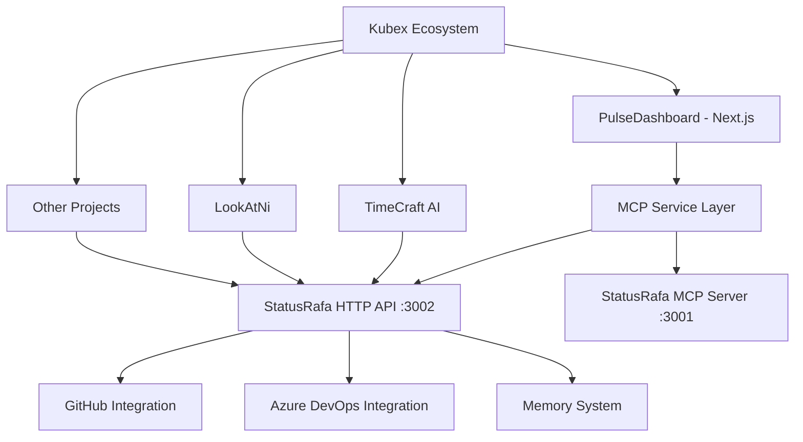

# 🚀 Pulse → MCP Server Integration Roadmap

## 🎯 Visão Geral da Integração

O PulseDashboard está sendo desenvolvido para se integrar perfeitamente com o **StatusRafa MCP Server**, criando um ecossistema completo de monitoramento e gerenciamento de desenvolvimento.

### 🏗️ Arquitetura da Integração



## 📋 Status Atual da Implementação

### ✅ **Fase 1 - Base Infrastructure** (COMPLETA)

- [x] Roteamento por URL implementado
- [x] Migração de tipos MCP organizados
- [x] Interface de gerenciamento de servidores
- [x] Sistema de layout responsivo
- [x] Páginas base criadas (Dashboard, Monitor, Analytics, Servers, Settings)

### 🚧 **Fase 2 - MCP Integration Prep** (EM PROGRESSO)

- [x] Tipos para integração MCP definidos
- [x] Serviço de comunicação HTTP criado (`mcpService.ts`)
- [x] Componente de teste de conectividade (`MCPConnectionTest`)
- [x] Interface base para provedores API
- [ ] Modais funcionais para CRUD de API providers
- [ ] Sistema de autenticação e tokens

### 🎯 **Fase 3 - Live Integration** (PRÓXIMA SESSÃO)

- [ ] Conexão real com StatusRafa HTTP API (porta 3002)
- [ ] Integração GitHub: repositórios e PRs
- [ ] Integração Azure DevOps: pipelines
- [ ] Sistema de memória compartilhada
- [ ] Sugestões automáticas de próximos passos

### 🔮 **Fase 4 - Advanced Features**

- [ ] WebSocket para atualizações em tempo real
- [ ] Dashboard interativo com widgets
- [ ] Sistema de notificações avançado
- [ ] Analytics e métricas detalhadas

## 🔌 Endpoints do MCP Server Mapeados

| Endpoint | Método | Função Frontend | Status |
|----------|--------|-----------------|---------|
| `/api/v1/status` | GET | Test connection, server health | ✅ |
| `/api/v1/repos` | GET | List GitHub repositories | 🚧 |
| `/api/v1/prs` | GET/POST | Pull requests management | 🚧 |
| `/api/v1/pipelines` | GET/POST | Azure DevOps pipelines | 🚧 |
| `/api/v1/memory` | GET/POST | Shared memory system | 🚧 |
| `/api/v1/suggest` | GET | AI-powered suggestions | 🚧 |
| `/api/v1/session` | GET | Session ID generation | 🚧 |

## 🛠️ Comandos de Desenvolvimento

### MCP Server (BackEnd)

```bash
# API Server HTTP
uv run --env-file ../.env mcp/api_server.py

# FastMCP Server
uv run --env-file ./.env ./timecraft_ai/mcp/server.py
```

### PulseFrontend

```bash
# Development
npm run dev

# Build
npm run build

# Linting
npm run lint
```

## 🔐 Configuração de Ambiente

### Variáveis Necessárias (.env)

```env
GITHUB_TOKEN=your_github_token
AZURE_DEVOPS_TOKEN=your_azure_token
AZURE_ORG=rafa-mori
AZURE_PROJECT=kubex
LOG_LEVEL=DEBUG
PORT=3001
```

### Portas Utilizadas

- **3000**: PulseDashboard (Next.js)
- **3001**: StatusRafa MCP Server (FastMCP/SSE)
- **3002**: StatusRafa HTTP API Server

## 📊 Integração de Dados

### GitHub Integration

- **Repositórios**: Lista automática de repos do usuário
- **Pull Requests**: Status, drafts, reviews pendentes
- **Atividade**: Commits, issues, discussões

### Azure DevOps Integration

- **Pipelines**: Status de build, deploy, testes
- **Work Items**: Tasks, bugs, user stories
- **Releases**: Deployment tracking

### Memory System

- **Shared Context**: Estado entre sessões
- **Decision Log**: Histórico de decisões
- **Progress Tracking**: Acompanhamento de progresso

## 🎨 UI/UX Strategy

### Design System

- **Tailwind CSS**: Styling framework
- **Dark Mode**: Full support
- **Responsive**: Mobile-first design
- **Lucide Icons**: Consistent iconography

### Component Architecture

```plaintext
src/
├── components/
│   ├── MCP/                 # MCP-specific components
│   │   ├── MCPConnectionTest.tsx
│   │   └── MCPSettings/
│   ├── Dashboard/           # Dashboard widgets
│   ├── Servers/            # Server management
│   └── UI/                 # Reusable UI components
├── lib/
│   └── mcpService.ts       # MCP integration service
└── types/
    ├── MCP/                # MCP type definitions
    └── APITypes.tsx        # API integration types
```

## 🚀 Next Session Goals

### 1. **Modal Implementation** (30 min)

- [ ] API Provider Add/Edit modals
- [ ] Form validation and error handling
- [ ] Connection testing UI

### 2. **Live MCP Connection** (60 min)

- [ ] Connect to running MCP server
- [ ] Display real GitHub repos
- [ ] Show live PR status
- [ ] Azure pipeline monitoring

### 3. **Data Integration** (45 min)

- [ ] Replace mock data with real API calls
- [ ] Error handling and loading states
- [ ] Real-time status updates

### 4. **Memory System Integration** (30 min)

- [ ] Shared context between frontend/backend
- [ ] Decision logging
- [ ] Progress persistence

## 💡 Innovation Highlights

### Unique Features

1. **Dual MCP Interface**: HTTP + FastMCP SSE
2. **Cross-Project Integration**: Lookatni + Pulse+ TimeCraft AI
3. **AI-Powered Suggestions**: Context-aware next steps
4. **Unified Dashboard**: GitHub + Azure DevOps + Custom tools
5. **Memory Persistence**: Shared context across sessions

### Technical Excellence

- **Type Safety**: Full TypeScript implementation
- **Modern Stack**: Next.js 15, React 18, Tailwind CSS
- **Real-time**: WebSocket ready architecture
- **Scalable**: Modular component design
- **Testable**: Jest/Vitest ready setup

## 🎉 Success Metrics

### Phase 2 (Current) Success Criteria

- [x] MCP connection test working
- [ ] All modals functional
- [ ] Error handling implemented
- [ ] Connection status real-time

### Phase 3 (Next Session) Success Criteria

- [ ] Live GitHub data displayed
- [ ] Azure pipelines monitoring
- [ ] Memory system working
- [ ] AI suggestions active

---

***Excited to see this integration come to life! 🔥***

The combination of modern frontend (Pulse + intelligent backend (StatusRafa MCP) + ecosystem integration (Kubex) is going to be **incredible**!

*Let's make development monitoring and project management a delightful experience!* ✨
