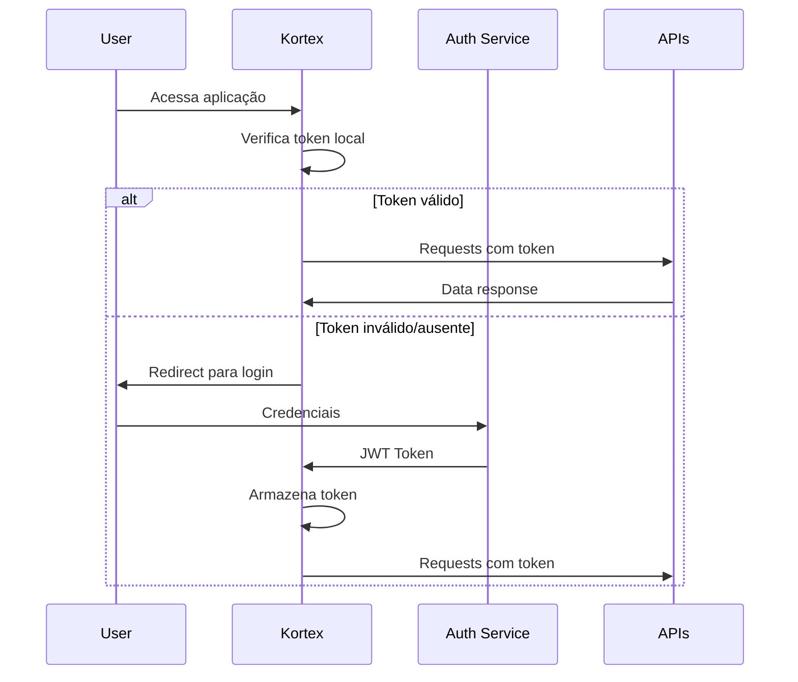

# Especificações Técnicas - Fase 1: Autenticação e Autorização

## 🎯 Objetivo

Implementar um sistema completo de autenticação e autorização para o Kortex, seguindo os padrões arquiteturais estabelecidos e garantindo segurança empresarial.

## 🏗️ Arquitetura de Autenticação

### Fluxo de Autenticação



### Estrutura de Permissões RBAC

```typescript
// Hierarquia de roles
const ROLE_HIERARCHY = {
  admin: ['operator', 'viewer'],
  operator: ['viewer'],
  viewer: []
};

// Permissões por recurso
const PERMISSIONS = {
  servers: {
    admin: ['create', 'read', 'update', 'delete'],
    operator: ['read', 'update'],
    viewer: ['read']
  },
  alerts: {
    admin: ['create', 'read', 'update', 'delete'],
    operator: ['read', 'update'],
    viewer: ['read']
  },
  settings: {
    admin: ['create', 'read', 'update', 'delete'],
    operator: [],
    viewer: []
  }
};
```

## 🔧 Implementação Detalhada

### 1. Tipos TypeScript Base

```typescript
// src/types/AuthTypes.tsx
export interface LoginCredentials {
  email: string;
  password: string;
  rememberMe?: boolean;
}

export interface OAuthCredentials {
  provider: 'github' | 'azure' | 'google';
  code: string;
  state: string;
}

export interface User {
  id: string;
  name: string;
  email: string;
  avatar?: string;
  roles: UserRole[];
  permissions: Permission[];
  lastLogin: Date;
  isActive: boolean;
  preferences: UserPreferences;
}

export interface UserRole {
  id: string;
  name: 'admin' | 'operator' | 'viewer';
  displayName: string;
  permissions: Permission[];
  description: string;
}

export interface Permission {
  id: string;
  resource: string;
  action: 'create' | 'read' | 'update' | 'delete';
  scope: 'own' | 'team' | 'all';
  conditions?: PermissionCondition[];
}

export interface PermissionCondition {
  field: string;
  operator: 'equals' | 'in' | 'not_in';
  value: any;
}

export interface UserPreferences {
  theme: 'light' | 'dark' | 'auto';
  language: string;
  timezone: string;
  notifications: NotificationPreferences;
}

export interface NotificationPreferences {
  email: boolean;
  push: boolean;
  alerts: boolean;
  digest: 'daily' | 'weekly' | 'never';
}

export interface AuthState {
  isAuthenticated: boolean;
  user: User | null;
  token: string | null;
  refreshToken: string | null;
  isLoading: boolean;
  error: string | null;
  permissions: Permission[];
  sessionExpiry: Date | null;
}

export interface AuthContextType extends AuthState {
  login: (credentials: LoginCredentials) => Promise<void>;
  loginWithOAuth: (credentials: OAuthCredentials) => Promise<void>;
  logout: () => void;
  refreshAuth: () => Promise<void>;
  hasPermission: (resource: string, action: string, scope?: string) => boolean;
  hasRole: (role: string) => boolean;
  canAccess: (resource: string) => boolean;
  updateUserPreferences: (preferences: Partial<UserPreferences>) => Promise<void>;
}
```

### 2. Context de Autenticação

```typescript
// src/context/AuthContext.tsx
import React, { createContext, useContext, useReducer, useEffect } from 'react';
import { AuthContextType, AuthState, User } from '../types/AuthTypes';
import { authReducer, initialAuthState } from './authReducer';
import { authService } from '../services/authService';
import { permissionService } from '../services/permissionService';

const AuthContext = createContext<AuthContextType | undefined>(undefined);

export const AuthProvider: React.FC<{ children: React.ReactNode }> = ({ children }) => {
  const [state, dispatch] = useReducer(authReducer, initialAuthState);

  useEffect(() => {
    initializeAuth();
  }, []);

  const initializeAuth = async () => {
    dispatch({ type: 'AUTH_LOADING' });

    try {
      const token = localStorage.getItem('auth_token');
      if (token) {
        const user = await authService.validateToken(token);
        if (user) {
          const permissions = await permissionService.getUserPermissions(user.id);
          dispatch({
            type: 'AUTH_SUCCESS',
            payload: { user, token, permissions }
          });
        } else {
          localStorage.removeItem('auth_token');
          dispatch({ type: 'AUTH_LOGOUT' });
        }
      } else {
        dispatch({ type: 'AUTH_LOGOUT' });
      }
    } catch (error) {
      dispatch({ type: 'AUTH_ERROR', payload: error.message });
    }
  };

  const login = async (credentials: LoginCredentials) => {
    dispatch({ type: 'AUTH_LOADING' });

    try {
      const response = await authService.login(credentials);
      const permissions = await permissionService.getUserPermissions(response.user.id);

      localStorage.setItem('auth_token', response.token);
      if (credentials.rememberMe) {
        localStorage.setItem('refresh_token', response.refreshToken);
      }

      dispatch({
        type: 'AUTH_SUCCESS',
        payload: {
          user: response.user,
          token: response.token,
          refreshToken: response.refreshToken,
          permissions
        }
      });
    } catch (error) {
      dispatch({ type: 'AUTH_ERROR', payload: error.message });
      throw error;
    }
  };

  const logout = () => {
    localStorage.removeItem('auth_token');
    localStorage.removeItem('refresh_token');
    dispatch({ type: 'AUTH_LOGOUT' });

    // Opcional: Notificar o backend sobre logout
    authService.logout().catch(console.error);
  };

  const hasPermission = (resource: string, action: string, scope?: string): boolean => {
    return permissionService.checkPermission(state.permissions, resource, action, scope);
  };

  const hasRole = (role: string): boolean => {
    return state.user?.roles.some(r => r.name === role) || false;
  };

  const canAccess = (resource: string): boolean => {
    return state.permissions.some(p => p.resource === resource);
  };

  const value: AuthContextType = {
    ...state,
    login,
    loginWithOAuth: authService.loginWithOAuth,
    logout,
    refreshAuth: authService.refreshToken,
    hasPermission,
    hasRole,
    canAccess,
    updateUserPreferences: authService.updateUserPreferences
  };

  return (
    <AuthContext.Provider value={value}>
      {children}
    </AuthContext.Provider>
  );
};

export const useAuth = (): AuthContextType => {
  const context = useContext(AuthContext);
  if (!context) {
    throw new Error('useAuth must be used within an AuthProvider');
  }
  return context;
};
```

### 3. Auth Reducer

```typescript
// src/context/authReducer.ts
import { AuthState } from '../types/AuthTypes';

export const initialAuthState: AuthState = {
  isAuthenticated: false,
  user: null,
  token: null,
  refreshToken: null,
  isLoading: false,
  error: null,
  permissions: [],
  sessionExpiry: null
};

type AuthAction =
  | { type: 'AUTH_LOADING' }
  | { type: 'AUTH_SUCCESS'; payload: { user: User; token: string; refreshToken?: string; permissions: Permission[] } }
  | { type: 'AUTH_ERROR'; payload: string }
  | { type: 'AUTH_LOGOUT' }
  | { type: 'UPDATE_USER'; payload: User }
  | { type: 'UPDATE_PERMISSIONS'; payload: Permission[] };

export const authReducer = (state: AuthState, action: AuthAction): AuthState => {
  switch (action.type) {
    case 'AUTH_LOADING':
      return { ...state, isLoading: true, error: null };

    case 'AUTH_SUCCESS':
      return {
        ...state,
        isAuthenticated: true,
        user: action.payload.user,
        token: action.payload.token,
        refreshToken: action.payload.refreshToken || state.refreshToken,
        permissions: action.payload.permissions,
        isLoading: false,
        error: null,
        sessionExpiry: new Date(Date.now() + 24 * 60 * 60 * 1000) // 24h
      };

    case 'AUTH_ERROR':
      return {
        ...state,
        isAuthenticated: false,
        user: null,
        token: null,
        refreshToken: null,
        permissions: [],
        isLoading: false,
        error: action.payload,
        sessionExpiry: null
      };

    case 'AUTH_LOGOUT':
      return initialAuthState;

    case 'UPDATE_USER':
      return { ...state, user: action.payload };

    case 'UPDATE_PERMISSIONS':
      return { ...state, permissions: action.payload };

    default:
      return state;
  }
};
```

### 4. Auth Service

```typescript
// src/services/authService.ts
import { LoginCredentials, OAuthCredentials, User } from '../types/AuthTypes';

class AuthService {
  private baseURL = process.env.NEXT_PUBLIC_API_URL || 'http://localhost:3001';

  async login(credentials: LoginCredentials) {
    const response = await fetch(`${this.baseURL}/auth/login`, {
      method: 'POST',
      headers: { 'Content-Type': 'application/json' },
      body: JSON.stringify(credentials)
    });

    if (!response.ok) {
      throw new Error('Login failed');
    }

    return response.json();
  }

  async loginWithOAuth(credentials: OAuthCredentials) {
    const response = await fetch(`${this.baseURL}/auth/oauth/${credentials.provider}`, {
      method: 'POST',
      headers: { 'Content-Type': 'application/json' },
      body: JSON.stringify({ code: credentials.code, state: credentials.state })
    });

    if (!response.ok) {
      throw new Error('OAuth login failed');
    }

    return response.json();
  }

  async validateToken(token: string): Promise<User | null> {
    try {
      const response = await fetch(`${this.baseURL}/auth/validate`, {
        headers: { Authorization: `Bearer ${token}` }
      });

      if (!response.ok) {
        return null;
      }

      return response.json();
    } catch {
      return null;
    }
  }

  async refreshToken(refreshToken: string) {
    const response = await fetch(`${this.baseURL}/auth/refresh`, {
      method: 'POST',
      headers: { 'Content-Type': 'application/json' },
      body: JSON.stringify({ refreshToken })
    });

    if (!response.ok) {
      throw new Error('Token refresh failed');
    }

    return response.json();
  }

  async logout() {
    const token = localStorage.getItem('auth_token');
    if (token) {
      await fetch(`${this.baseURL}/auth/logout`, {
        method: 'POST',
        headers: { Authorization: `Bearer ${token}` }
      });
    }
  }

  async updateUserPreferences(preferences: Partial<UserPreferences>) {
    const token = localStorage.getItem('auth_token');
    const response = await fetch(`${this.baseURL}/user/preferences`, {
      method: 'PATCH',
      headers: {
        'Content-Type': 'application/json',
        Authorization: `Bearer ${token}`
      },
      body: JSON.stringify(preferences)
    });

    if (!response.ok) {
      throw new Error('Failed to update preferences');
    }

    return response.json();
  }
}

export const authService = new AuthService();
```

### 5. Permission Service

```typescript
// src/services/permissionService.ts
import { Permission } from '../types/AuthTypes';

class PermissionService {
  checkPermission(
    permissions: Permission[],
    resource: string,
    action: string,
    scope?: string
  ): boolean {
    return permissions.some(permission => {
      const hasResource = permission.resource === resource || permission.resource === '*';
      const hasAction = permission.action === action || permission.action === '*';
      const hasScope = !scope || permission.scope === scope || permission.scope === 'all';

      return hasResource && hasAction && hasScope;
    });
  }

  async getUserPermissions(userId: string): Promise<Permission[]> {
    const response = await fetch(`${process.env.NEXT_PUBLIC_API_URL}/user/${userId}/permissions`);
    if (!response.ok) {
      throw new Error('Failed to fetch permissions');
    }
    return response.json();
  }

  filterByPermission<T extends { id: string }>(
    items: T[],
    permissions: Permission[],
    resource: string,
    action: string = 'read'
  ): T[] {
    if (this.checkPermission(permissions, resource, action, 'all')) {
      return items;
    }

    // Implementar lógica de filtro baseada em scope 'own' ou 'team'
    return items.filter(item => {
      // Lógica específica baseada no contexto
      return true;
    });
  }
}

export const permissionService = new PermissionService();
```

## 🧪 Estratégia de Testes

### Testes Unitários

```typescript
// src/context/__tests__/AuthContext.test.tsx
import { renderHook, act } from '@testing-library/react-hooks';
import { AuthProvider, useAuth } from '../AuthContext';

describe('AuthContext', () => {
  it('should initialize with unauthenticated state', () => {
    const { result } = renderHook(() => useAuth(), {
      wrapper: AuthProvider
    });

    expect(result.current.isAuthenticated).toBe(false);
    expect(result.current.user).toBeNull();
  });

  it('should authenticate user successfully', async () => {
    const mockCredentials = { email: 'test@test.com', password: 'password' };

    const { result } = renderHook(() => useAuth(), {
      wrapper: AuthProvider
    });

    await act(async () => {
      await result.current.login(mockCredentials);
    });

    expect(result.current.isAuthenticated).toBe(true);
    expect(result.current.user).toBeDefined();
  });
});
```

### Testes de Integração

```typescript
// src/services/__tests__/authService.integration.test.ts
import { authService } from '../authService';

describe('AuthService Integration', () => {
  it('should login and return valid token', async () => {
    const credentials = { email: 'test@kortex.com', password: 'testpass' };
    const response = await authService.login(credentials);

    expect(response.token).toBeDefined();
    expect(response.user).toBeDefined();
    expect(response.user.email).toBe(credentials.email);
  });
});
```

## 🔒 Considerações de Segurança

### Token Management

- JWT tokens com expiração de 1 hora
- Refresh tokens com expiração de 7 dias
- Armazenamento seguro em httpOnly cookies (produção)
- Fallback para localStorage (desenvolvimento)

### Validação de Entrada

- Sanitização de todos os inputs
- Validação de email format
- Força de senha configurável
- Rate limiting para tentativas de login

### HTTPS e CORS

- Obrigatório HTTPS em produção
- CORS configurado para domínios específicos
- Content Security Policy (CSP) headers

## 📋 Checklist de Implementação

### Semana 1: Fundação

- [ ] Criar estrutura de tipos TypeScript
- [ ] Implementar AuthContext base
- [ ] Setup de AuthReducer
- [ ] Configurar AuthService
- [ ] Implementar PermissionService

### Semana 2: Hooks e Lógica

- [ ] Hook useAuth completo
- [ ] Hook usePermissions
- [ ] Hook useProtectedRoute
- [ ] Middleware de autenticação
- [ ] Interceptors para API calls

### Semana 3: UI Components

- [ ] LoginForm component
- [ ] ProtectedRoute HOC
- [ ] PermissionGate component
- [ ] UserProfile component
- [ ] Logout functionality

### Semana 4: Testes e Refinamento

- [ ] Testes unitários (80%+ cobertura)
- [ ] Testes de integração
- [ ] Security audit
- [ ] Performance testing
- [ ] Documentation completa

## 🎯 Critérios de Aceitação

### Funcionais

- [x] Login com email/senha funcional
- [x] OAuth com GitHub/Azure implementado
- [x] Sistema RBAC funcionando
- [x] Proteção de rotas ativa
- [x] Logout e refresh token funcionais

### Técnicos

- [x] Zero vulnerabilidades de segurança
- [x] Cobertura de testes > 80%
- [x] Performance < 200ms para auth checks
- [x] Compatibilidade com TypeScript strict
- [x] Documentação completa

### UX/UI

- [x] Interface intuitiva de login
- [x] Feedback visual de estados de loading
- [x] Mensagens de erro claras
- [x] Transições suaves entre estados
- [x] Acessibilidade (WCAG 2.1 AA)
